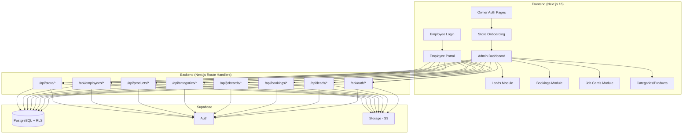

# Rasko — Field Service Management + CRM Platform

A multi-tenant FSM+CRM system built with **Next.js 16** (App Router) + **Supabase** (Auth, Database, Storage, RLS).

## Current State

- Fresh Next.js 16 project with Tailwind CSS 4
- Supabase project already provisioned (credentials in `.env`)
- No existing business logic — blank slate

---

## User Review Required

> [!IMPORTANT]
> **Authentication Strategy**: Store owners sign up via **email/password or Google OAuth** (Supabase Auth). Employees log in via **username/password credentials** provisioned by the store owner. Employees are stored in an `employees` table (not Supabase Auth users) and authenticated via a custom JWT-based session.

> [!WARNING]
> **Next.js 16 Breaking Changes**: This version uses `proxy.ts` instead of `middleware.ts` for request interception. Route handler `params` are now Promises. We will follow the docs in `node_modules/next/dist/docs/`.

> [!IMPORTANT]
> **Phased Delivery**: This is a large system. I recommend building it in **7 phases**, shipping each phase as a working increment. Phase 1-3 are the foundation; Phase 4-7 add business features. **Do you want me to build all phases, or start with Phase 1-3 first?**

---

## Architecture Overview



---

## Proposed Changes

### Phase 1: Foundation — Supabase Schema, Auth, Project Structure

---

#### [NEW] Supabase SQL Schema

Run in Supabase SQL Editor. Creates all tables, enums, indexes, and RLS policies.

**Tables:**

| Table | Purpose |
|-------|---------|
| `stores` | Multi-tenant root — business profile |
| `store_members` | Links Supabase auth users to stores (owner role) |
| `employees` | Employee accounts (username/password, scoped to store) |
| `categories` | Service categories per store |
| `products` | Services/products under categories |
| `leads` | CRM leads with status pipeline |
| `bookings` | Service booking requests |
| `jobcards` | Core FSM entity — work orders |
| `jobcard_items` | Products/services used in a jobcard |
| `subscriptions` | Store subscription/plan info |

**Enums:**
- `lead_status`: `new → contacted → qualified → converted → lost`
- `booking_status`: `pending → confirmed → assigned → completed → cancelled`
- `jobcard_status`: `open → in_progress → completed → closed`
- `lead_source`: `manual, website, whatsapp`
- `member_role`: `owner, admin`

**RLS Policies (Critical):**
- All tables enforce `store_id` isolation via `auth.uid()` → `store_members` lookup
- Employees can only read their assigned jobcards + related bookings
- Owners/admins have full CRUD within their store

```sql
-- Example RLS pattern for all tables:
CREATE POLICY "store_isolation" ON leads
  USING (store_id IN (
    SELECT store_id FROM store_members WHERE user_id = auth.uid()
  ));
```

---

#### [NEW] [supabase/](file:///c:/Users/satya/Documents/rasko/rasko/supabase/) directory

| File | Purpose |
|------|---------|
| `schema.sql` | Complete DDL — tables, enums, indexes |
| `rls.sql` | All RLS policies |
| `seed.sql` | Optional dev seed data |

---

#### [NEW] [app/lib/supabase/](file:///c:/Users/satya/Documents/rasko/rasko/app/lib/supabase/) — Supabase Client Utilities

| File | Purpose |
|------|---------|
| `server.ts` | Server-side Supabase client (cookies-based) |
| `client.ts` | Browser-side Supabase client |
| `admin.ts` | Service-role client for admin operations |

---

#### [NEW] [proxy.ts](file:///c:/Users/satya/Documents/rasko/rasko/proxy.ts) — Request Proxy (replaces middleware)

- Refreshes Supabase auth session on every request
- Protects `/dashboard/*` routes — redirects to `/login` if unauthenticated
- Protects `/employee/*` routes — checks employee JWT cookie
- Allows public routes: `/`, `/login`, `/signup`, `/employee/login`, `/api/auth/*`

---

#### [NEW] Auth Pages & API Routes

| File | Purpose |
|------|---------|
| `app/(auth)/login/page.tsx` | Owner login (email + Google OAuth) |
| `app/(auth)/signup/page.tsx` | Owner signup |
| `app/(auth)/layout.tsx` | Auth pages layout (centered, branded) |
| `app/api/auth/callback/route.ts` | Google OAuth callback handler |
| `app/employee/login/page.tsx` | Employee login (username/password) |
| `app/api/auth/employee-login/route.ts` | Employee auth → issues JWT cookie |
| `app/api/auth/employee-logout/route.ts` | Clears employee session |

**Owner Auth Flow:**
1. Signup with email/password → Supabase Auth `signUp()`
2. Or "Continue with Google" → Supabase Auth `signInWithOAuth()`
3. On first login, redirect to `/onboarding` if no store exists
4. Session managed by Supabase Auth cookies (refreshed in `proxy.ts`)

**Employee Auth Flow:**
1. Store owner creates employee with username + password (stored hashed in `employees` table)
2. Employee visits `/employee/login`, enters credentials
3. API route verifies credentials, issues a signed JWT cookie containing `{ employee_id, store_id }`
4. `proxy.ts` validates employee JWT on `/employee/*` routes

---

### Phase 2: Store Onboarding + Dashboard Shell

---

#### [NEW] [app/(dashboard)/](file:///c:/Users/satya/Documents/rasko/rasko/app/(dashboard)/) — Dashboard Route Group

| File | Purpose |
|------|---------|
| `layout.tsx` | Dashboard shell — sidebar, topbar, auth guard |
| `page.tsx` | Dashboard home — stats cards, charts |
| `onboarding/page.tsx` | Store setup wizard (first-time flow) |

**Onboarding Fields:**
- Store name, logo (upload to Supabase Storage), address
- Service areas (city/pincode — multi-select)
- Contact details (phone, email, website)
- Working hours (per-day schedule)

#### [NEW] [app/components/](file:///c:/Users/satya/Documents/rasko/rasko/app/components/) — Shared UI Components

| File | Purpose |
|------|---------|
| `ui/Button.tsx` | Reusable button with variants |
| `ui/Input.tsx` | Form input with label + error state |
| `ui/Select.tsx` | Dropdown select |
| `ui/Modal.tsx` | Dialog/modal component |
| `ui/Badge.tsx` | Status badge (colored by status) |
| `ui/Card.tsx` | Content card |
| `ui/DataTable.tsx` | Sortable, filterable table |
| `ui/StatusPipeline.tsx` | Visual pipeline for lead/booking/job status |
| `layout/Sidebar.tsx` | Dashboard sidebar navigation |
| `layout/Topbar.tsx` | Dashboard top bar (user menu, notifications) |
| `layout/MobileNav.tsx` | Mobile bottom navigation |

#### [NEW] [app/api/store/](file:///c:/Users/satya/Documents/rasko/rasko/app/api/store/) — Store API

| File | Purpose |
|------|---------|
| `route.ts` | `GET` current store, `POST` create store (onboarding) |
| `[id]/route.ts` | `PATCH` update store settings |
| `[id]/logo/route.ts` | `POST` upload logo to Supabase Storage |

---

### Phase 3: Categories & Products Management

---

#### [NEW] Dashboard Pages

| File | Purpose |
|------|---------|
| `app/(dashboard)/categories/page.tsx` | Categories list + CRUD |
| `app/(dashboard)/categories/[id]/page.tsx` | Category detail + products under it |
| `app/(dashboard)/products/page.tsx` | All products list |
| `app/(dashboard)/products/new/page.tsx` | Create product form |
| `app/(dashboard)/products/[id]/page.tsx` | Edit product |

#### [NEW] API Routes

| File | Purpose |
|------|---------|
| `app/api/categories/route.ts` | `GET` list, `POST` create |
| `app/api/categories/[id]/route.ts` | `GET`, `PATCH`, `DELETE` |
| `app/api/products/route.ts` | `GET` list, `POST` create |
| `app/api/products/[id]/route.ts` | `GET`, `PATCH`, `DELETE` |

---

### Phase 4: Leads CRM Module

---

#### [NEW] Dashboard Pages

| File | Purpose |
|------|---------|
| `app/(dashboard)/leads/page.tsx` | Leads list with pipeline view + table view |
| `app/(dashboard)/leads/new/page.tsx` | Create lead form |
| `app/(dashboard)/leads/[id]/page.tsx` | Lead detail — notes, status changes, convert to booking |

#### [NEW] API Routes

| File | Purpose |
|------|---------|
| `app/api/leads/route.ts` | `GET` list (filterable), `POST` create |
| `app/api/leads/[id]/route.ts` | `GET`, `PATCH` (status transition), `DELETE` |
| `app/api/leads/[id]/convert/route.ts` | `POST` — converts lead → booking |

**Lead Pipeline Logic:**
```
new → contacted → qualified → converted → lost
                                    ↓
                              creates booking
```

---

### Phase 5: Bookings + Job Cards (Core FSM)

---

#### [NEW] Booking Pages

| File | Purpose |
|------|---------|
| `app/(dashboard)/bookings/page.tsx` | Bookings list with status filters |
| `app/(dashboard)/bookings/new/page.tsx` | Create booking form |
| `app/(dashboard)/bookings/[id]/page.tsx` | Booking detail — assign employee, create jobcard |

#### [NEW] Job Card Pages

| File | Purpose |
|------|---------|
| `app/(dashboard)/jobcards/page.tsx` | Job cards list with status filters |
| `app/(dashboard)/jobcards/[id]/page.tsx` | Job card detail — items, images, notes, status |

#### [NEW] API Routes

| File | Purpose |
|------|---------|
| `app/api/bookings/route.ts` | `GET`, `POST` |
| `app/api/bookings/[id]/route.ts` | `GET`, `PATCH`, `DELETE` |
| `app/api/bookings/[id]/assign/route.ts` | `POST` assign employee |
| `app/api/bookings/[id]/jobcard/route.ts` | `POST` create jobcard from booking |
| `app/api/jobcards/route.ts` | `GET`, `POST` |
| `app/api/jobcards/[id]/route.ts` | `GET`, `PATCH` |
| `app/api/jobcards/[id]/items/route.ts` | `GET`, `POST` items used |
| `app/api/jobcards/[id]/images/route.ts` | `POST` upload images |

**Key Business Logic:**
- `convertLeadToBooking()` — creates booking, updates lead status to `converted`
- `assignEmployee()` — sets employee_id on booking, changes status to `assigned`
- `createJobcard()` — creates jobcard from booking (or standalone)
- `completeJob()` — marks jobcard `completed`, updates booking status

---

### Phase 6: Employee Portal

---

#### [NEW] Employee Pages

| File | Purpose |
|------|---------|
| `app/employee/layout.tsx` | Employee portal layout (simpler, mobile-first) |
| `app/employee/page.tsx` | Employee dashboard — assigned jobs |
| `app/employee/jobs/[id]/page.tsx` | Job detail — add products, upload images, mark complete |

#### [NEW] Employee Management (Admin side)

| File | Purpose |
|------|---------|
| `app/(dashboard)/employees/page.tsx` | Employees list |
| `app/(dashboard)/employees/new/page.tsx` | Create employee (set username/password) |
| `app/(dashboard)/employees/[id]/page.tsx` | Edit employee, view job history |
| `app/api/employees/route.ts` | `GET`, `POST` (create w/ hashed password) |
| `app/api/employees/[id]/route.ts` | `GET`, `PATCH`, `DELETE` |

---

### Phase 7: Dashboard Analytics + Polish

---

#### [NEW] Dashboard Enhancements

| File | Purpose |
|------|---------|
| `app/(dashboard)/page.tsx` (update) | Rich dashboard with charts |
| `app/lib/analytics.ts` | Query helpers for stats |

**Dashboard Metrics:**
- Leads conversion rate (leads → bookings ratio)
- Booking stats (by status, by week/month)
- Job completion rate
- Revenue from completed jobcards
- Employee performance (jobs completed, avg time)
- Top services (most used products)

---

## Complete Folder Structure

```
rasko/
├── supabase/
│   ├── schema.sql
│   ├── rls.sql
│   └── seed.sql
├── proxy.ts                        # Replaces middleware.ts
├── app/
│   ├── globals.css
│   ├── layout.tsx                  # Root layout
│   ├── page.tsx                    # Landing/marketing page
│   ├── lib/
│   │   ├── supabase/
│   │   │   ├── server.ts
│   │   │   ├── client.ts
│   │   │   └── admin.ts
│   │   ├── auth.ts                 # Auth helpers (getUser, requireAuth)
│   │   ├── employee-auth.ts        # Employee JWT sign/verify
│   │   ├── definitions.ts          # Zod schemas + TypeScript types
│   │   └── analytics.ts            # Dashboard query helpers
│   ├── actions/
│   │   ├── auth.ts                 # Server Actions for auth forms
│   │   ├── store.ts                # Server Actions for store CRUD
│   │   ├── leads.ts                # Server Actions for leads
│   │   ├── bookings.ts             # Server Actions for bookings
│   │   ├── jobcards.ts             # Server Actions for jobcards
│   │   └── employees.ts            # Server Actions for employee mgmt
│   ├── components/
│   │   ├── ui/                     # Reusable primitives
│   │   └── layout/                 # Shell components
│   ├── (auth)/
│   │   ├── layout.tsx
│   │   ├── login/page.tsx
│   │   └── signup/page.tsx
│   ├── (dashboard)/
│   │   ├── layout.tsx              # Sidebar + Topbar shell
│   │   ├── page.tsx                # Dashboard home
│   │   ├── onboarding/page.tsx
│   │   ├── categories/...
│   │   ├── products/...
│   │   ├── leads/...
│   │   ├── bookings/...
│   │   ├── jobcards/...
│   │   └── employees/...
│   ├── employee/
│   │   ├── login/page.tsx
│   │   ├── layout.tsx
│   │   ├── page.tsx
│   │   └── jobs/[id]/page.tsx
│   └── api/
│       ├── auth/
│       │   ├── callback/route.ts
│       │   ├── employee-login/route.ts
│       │   └── employee-logout/route.ts
│       ├── store/...
│       ├── categories/...
│       ├── products/...
│       ├── leads/...
│       ├── bookings/...
│       ├── jobcards/...
│       └── employees/...
```

---

## Dependencies to Install

```bash
npm install @supabase/supabase-js @supabase/ssr jose bcryptjs zod server-only
npm install -D @types/bcryptjs
```

| Package | Purpose |
|---------|---------|
| `@supabase/supabase-js` | Supabase client |
| `@supabase/ssr` | SSR cookie helpers for Supabase |
| `jose` | JWT signing/verification for employee auth |
| `bcryptjs` | Password hashing for employees |
| `zod` | Schema validation |
| `server-only` | Prevents server code from being imported in client |

---

## Open Questions

> [!IMPORTANT]
> **1. Build all phases at once, or iteratively?**
> This is a large system (~60+ files). I recommend building **Phase 1-3 first** (auth, onboarding, categories/products) as a working foundation, then layering on Phase 4-7. What do you prefer?

> [!IMPORTANT]
> **2. Notifications (WhatsApp/Email)** — You mentioned WhatsApp via Twilio and Email via Brevo. Should I include notification integration in the initial build, or defer it? These require API keys and paid services.

> [!IMPORTANT]
> **3. Razorpay Subscriptions** — Should I include the subscription/payment flow now, or build it as a later phase? This requires Razorpay API keys and webhook setup.

> [!IMPORTANT]
> **4. Landing Page** — Do you want a marketing/landing page at `/`, or should `/` redirect straight to the dashboard?

> [!IMPORTANT]
> **5. S3 vs Supabase Storage** — You mentioned Amazon S3 for images. Supabase has built-in Storage (backed by S3). Should I use Supabase Storage (simpler, already configured) or direct S3?

---

## Verification Plan

### Automated Tests
- Run `npm run build` to ensure no TypeScript/build errors
- Test all API routes via browser dev tools / curl
- Verify RLS policies block cross-store data access

### Manual Verification
- Sign up as owner → complete onboarding → create categories/products
- Create employees → log in as employee → view assigned jobs
- Full workflow: Lead → Booking → Assign Employee → Create Jobcard → Complete
- Verify Google OAuth login flow
- Test on mobile viewport (responsive design)
